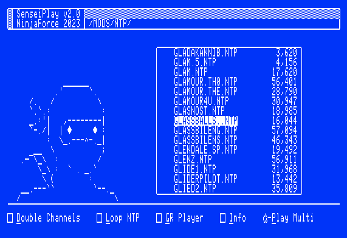
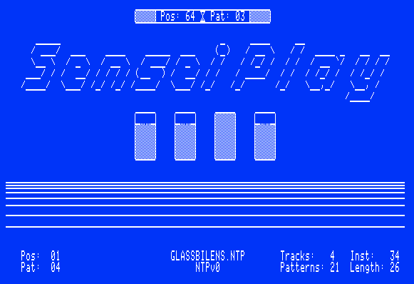
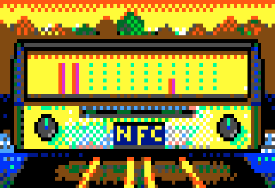

# SenseiPlay

NTP "Module" player for Apple IIgs by digarok of NinjaForce

This uses the NinjaTrackerPlus playback engine developed by Jesse Blue of NinjaForce.

## About

Meant to be a fast and lightweight player for your NTP songs.  SenseiPlay is written in assembly for ProDOS 8 and has very low memory requirements. 



Navigation is easy as you scroll through your songs, moving in and out of folders.  Hit return to play a song or "OpenApple-P" to play multiple songs in jukebox style.
Hit "Tab" key to go directly to online volumes.



While a song is playing you can use the following keys:

- I = Toggle Song Information
- G = Toggle GR player
- N = Next Song (in multi mode)
- Esc = Back to menu




## About the code
The code is written in 65816 Assembly Language (Merlin compatible).

```
└── src
    ├── sp.s              <- Main Program (Prodos8)
    ├── p8tools.s         <- lib - Prodos8 tools
    ├── gstools.s         <- lib - Actual IIgs toolbox routines
    ├── scrollist.s       <- lib - scroll list widget
    ├── texttools.s       <- lib - text tools
    └── vubars.s          <- code to render text VUs
```

## Goals
Initially this was an internal tool to test directories full of converted songs, but it's expanded to include a full file navigation UI and playback UI.

The overarching goals for the way it is written are:
- Boot from Prodos8 so it can fit on a floppy with multiple songs for a musicdisk
- Use very little memory (again is a P8 app) to be able to even run on original 256KB machines
- Have a unique style, even in text mode.  

## Converting your own songs

You can write your own MODs using OpenMPT and convert them using the conversion program in the NinjaTrackerPlus archive.  
```
php ninjatrackerplus/ntpconverter.php MYSONG.MOD
```
Or you can just use the online converter!
http://www.ninjaforce.com/html/products_ninjatrackerplus.php

## Checkout and Build 

After you clone this repository you will need to add the ninjatrackerplus sources to your the ninjatrackerplus directory.  
https://www.ninjaforce.com/downloads/ntpsources.zip
### NTP Setup
```
cd ninjatrackerplus
curl -O -J -L http://www.ninjaforce.com/downloads/ntpsources.zip
unzip ntpsources.zip
merlin32 . ninjatrackerplus.s
```
### SenseiPlay assembly
You can build it using my project tool which will also generate a disk image, [Appy](https://github.com/digarok/appy), or just run [merlin32](https://brutaldeluxe.fr/products/crossdevtools/merlin/) on the source yourself. 
```
merlin32 -V . src/sp.s
``` 